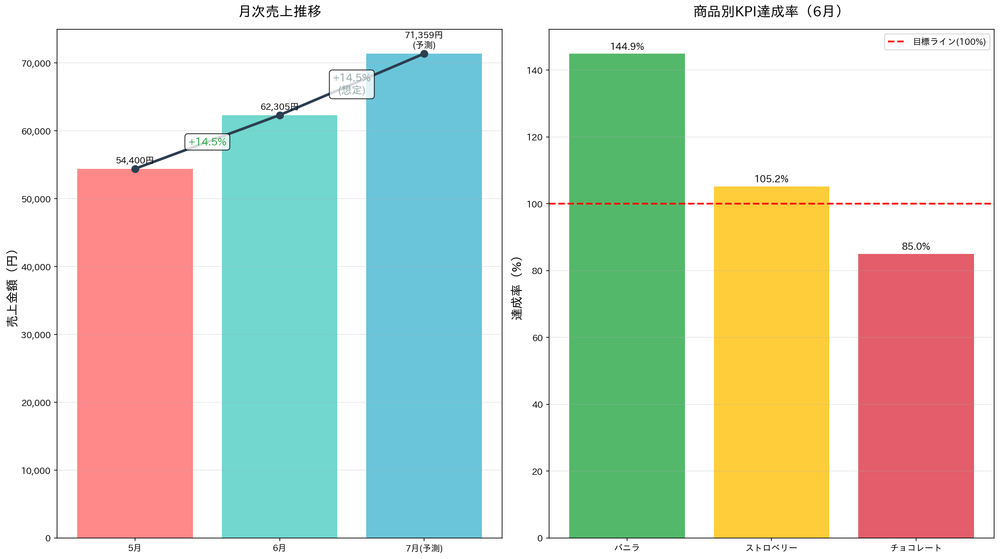
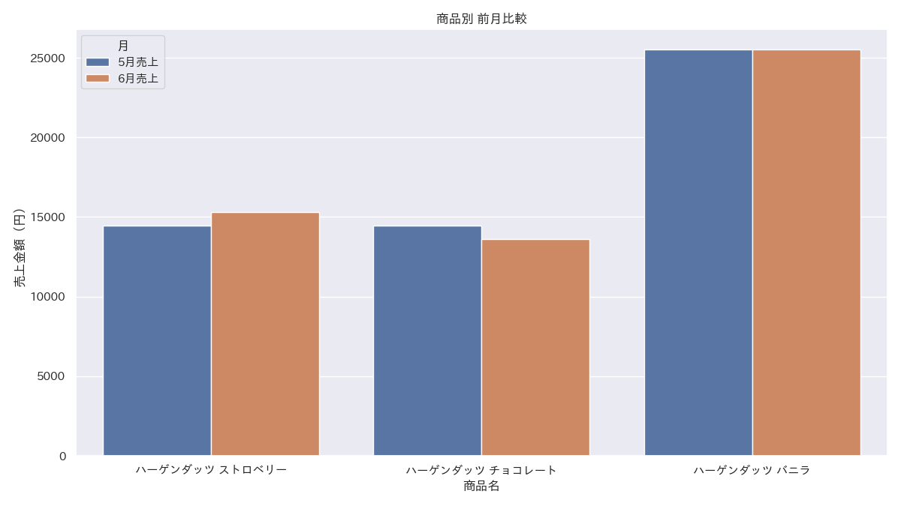
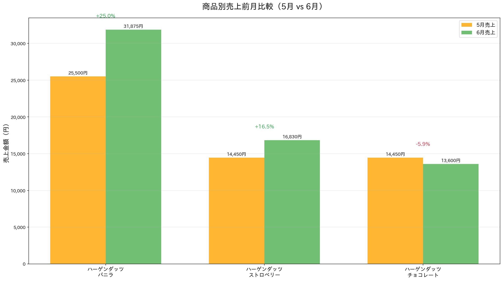
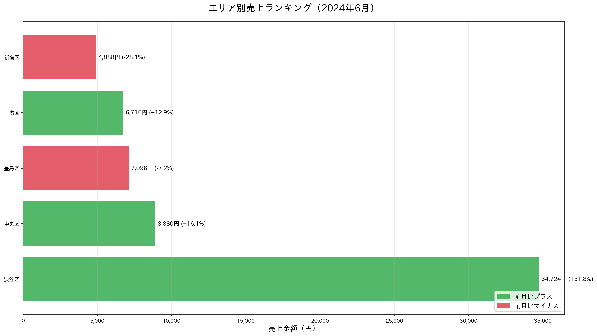
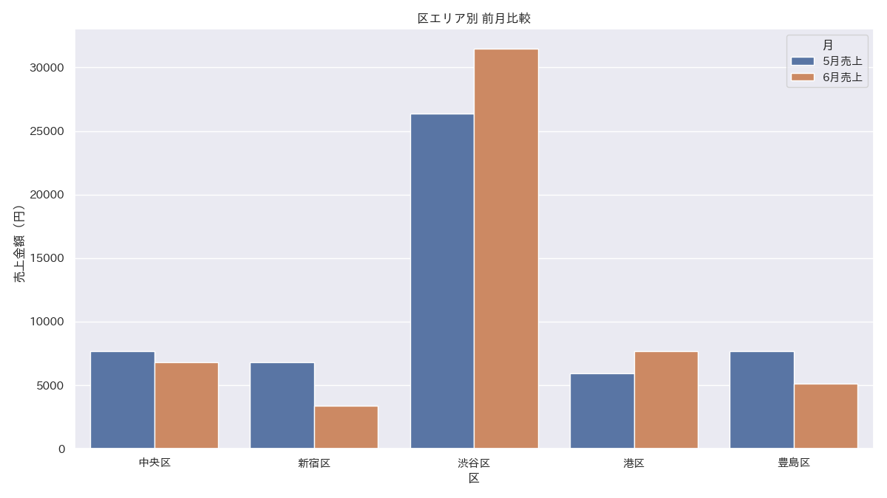

# 2024年6月度売上報告

**営業部門 月次定例報告**

---

## 📊 エグゼクティブサマリー

### 🎯 **総合実績**
- **総売上**: 62,305円（前月比 **+14.5%**）
- **総販売数量**: 408個（前月比 **+40.7%**）
- **売上目標達成率**: **114.8%** ✅

### 📈 **成長のポイント**
- 全体売上が順調に成長、目標を大幅に上回る
- 販売数量の大幅増加（前月比+40.7%）
- 夏季需要の高まりが顕著に現れる

---

## 📊 月次推移とKPI達成状況

---

## 🎯 商品別KPI達成状況

### ✅ **好調商品**
- **ハーゲンダッツ バニラ**: 売上達成率 **144.9%**
- **ハーゲンダッツ ストロベリー**: 売上達成率 **105.2%**

### ⚠️ **改善必要商品**  
- **ハーゲンダッツ チョコレート**: 売上達成率 **85.0%**

---

## 📊 商品別実績 vs 目標

---

## 📈 商品別売上トレンド分析

### 🍦 **ハーゲンダッツ バニラ**
- 売上: **+25.0%** (25,500円 → 31,875円)
- **安定した成長**を維持

### 🍓 **ハーゲンダッツ ストロベリー**
- 売上: **+16.5%** (14,450円 → 16,830円)
- 数量: **+85.3%** - **夏季需要の高まり**

### 🍫 **ハーゲンダッツ チョコレート**
- 売上: **-5.9%** (14,450円 → 13,600円)
- **課題**: 売上単価の低下傾向

---

## 📊 商品別前月比較

---

## 🏪 エリア別動向分析

### **売上ランキング（6月実績）**

| 順位 | エリア | 売上金額 | 前月比 |
|------|--------|----------|--------|
| **1位** | **渋谷区** | 34,724円 | **+31.8%** 🔥 |
| **2位** | **中央区** | 8,880円 | **+16.1%** |
| **3位** | **豊島区** | 7,098円 | **-7.2%** |
| **4位** | **港区** | 6,715円 | **+12.9%** |
| **5位** | **新宿区** | 4,888円 | **-28.1%** ⚠️ |

---

## 📊 エリア別売上ランキング

---

## 📊 エリア別動向比較

---

## 🔮 7月度予測

### **売上予測（トレンドベース）**
- **予測売上**: 71,359円
- **予測成長率**: +14.5%（継続成長想定）

### **予測根拠**
- 6月の成長率（+14.5%）継続を想定
- 夏季需要の持続による堅調推移期待
- ストロベリー・バニラの好調トレンド継続

---

## ⚠️ 重要課題と対策

### **🚨 緊急課題**

#### 1. **チョコレート商品の売上単価低下**
- 数量増加も売上減少
- **対策**: プレミアム商品誘導強化

#### 2. **新宿エリアの売上大幅減**
- 前月比 **-28.1%** の深刻状況
- **対策**: 競合分析と運営見直し

---

## 💡 改善提案

### **商品戦略**
- チョコレート商品の価格戦略見直し
- 夏季限定フレーバーの投入検討

### **エリア戦略**
- 渋谷区成功モデルの他エリア展開
- 新宿店運営改善プロジェクト立ち上げ

### **販促施策**
- ストロベリー・バニラ好調活用のクロスセル
- エリア別ターゲティング広告実施

---

## 📋 次月アクションプラン

### **優先度A（緊急）**
- ✅ 新宿店の売上回復施策実行
- ✅ チョコレート商品の価格・販促戦略見直し

### **優先度B（重要）**
- ✅ 渋谷区成功要因分析と他エリア展開
- ✅ 夏季商品ラインナップ強化

### **優先度C（フォロー）**
- ✅ 月次予測モデル精度向上
- ✅ 顧客満足度調査実施検討

---

## 🎯 まとめ

### **✅ 好調ポイント**
- **総売上目標達成率114.8%**で順調成長
- バニラ・ストロベリーが牽引
- 渋谷区エリアが圧倒的好調

### **⚠️ 注意ポイント**
- チョコレート商品要改善
- 新宿エリア緊急対策必要

### **🚀 今後の方針**
- 好調商品・エリアの成功モデル展開
- 課題商品・エリアの集中改善

---

## ご質問・ご意見

**ありがとうございました**

*作成日: 2024年7月21日*  
*データ分析部*