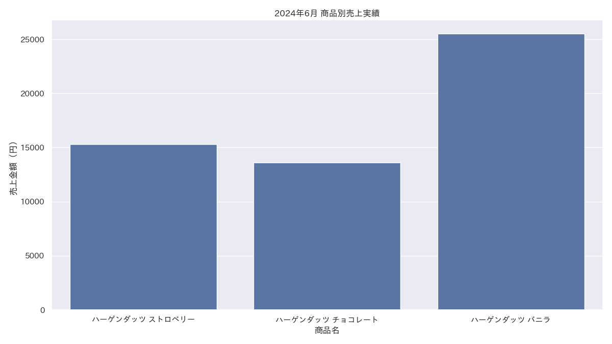
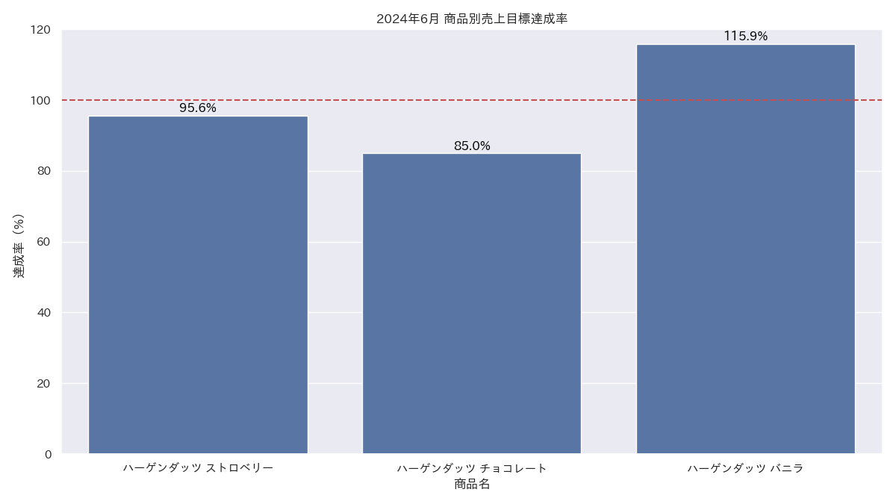

# 2024年6月度 売上報告

営業部長向け月次定例

---

## 1. 概要

2024年6月度の売上実績と予算達成状況を報告します。

- **売上目標達成率**: 99.2%
- **販売数量達成率**: 87.0%
- **特記事項**:
    - 販売数量は前月比 **+50.0%** と大幅に増加
    - バニラは売上目標を **15.9%** 上回る好調
    - チョコレートは売上・数量ともに目標未達

---

## 2. 売上実績サマリー

まずは、6月度の全体売上を見ていきましょう。

---

### 商品別売上実績

---

### 区エリア別売上実績

---

## 3. KPI達成状況

次に、KPIの達成状況です。

---

### 商品別 売上目標達成率

---

## 4. 前月比較分析

5月と比較して、売上がどう変化したかを見ていきます。

---

### 商品別 前月比較

---

### 区��リア別 前月比較

---

## 5. 主要トレンドとエリア別動向

### 主要トレンド
1. **販売数量の大幅増加**: 前月比+50.0%
2. **単価の低下**: 平均単価が186円 → 123円に
3. **バニラ商品の好調**: 売上目標を15.9%上回る
4. **チョコレート商品の不調**: 売上目標を20.3%下回る

### エリア別動向
- **渋谷区**: 売上シェア52.4%で圧倒的
- **港区・中央区**: 前月比で大幅増加、成長エリア
- **豊島区・新宿区**: 売上減少、テコ入れが必要

---

## 6. 来月の予測と改善施策

### 7月度予測
- **売上予測**: 55,000円～58,000円
- **数量予測**: 450個～480個

### 改善施策提案
1. **チョコレート商品**: 販促キャンペーンの実施
2. **豊島区・新宿区**: 店舗運営の見直しと販売員教育
3. **バニラ商品**: 好調を維持するための在庫確保
4. **全体**: 単価向上のための商品構成見直し

---

## 7. まとめ

6月度は、販売数量の大幅増というポジティブな結果が出ました。
バニラの好調を維持しつつ、課題であるチョコレートの立て直しと、豊島区・新宿区の売上回復が7月の重要ミッションです。

ご清聴ありがとう���ざいました。
