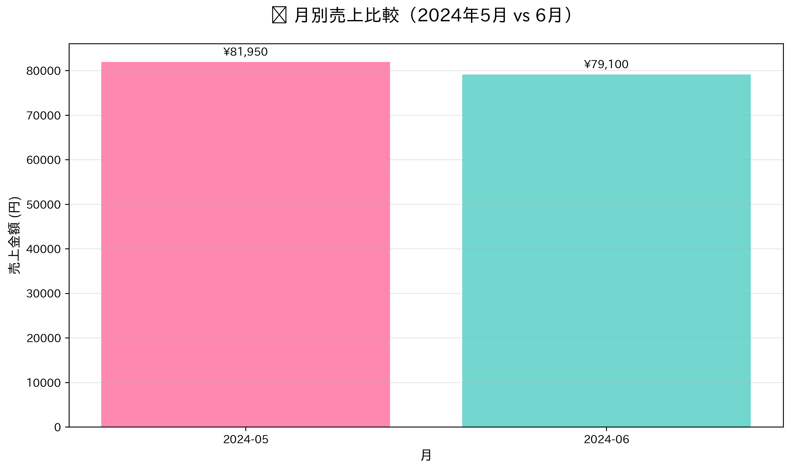
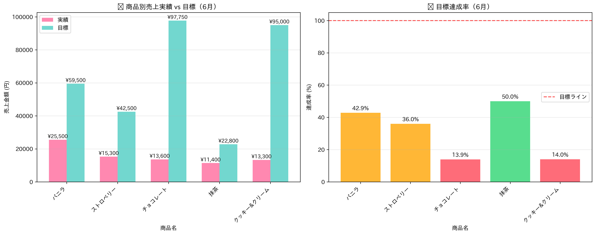
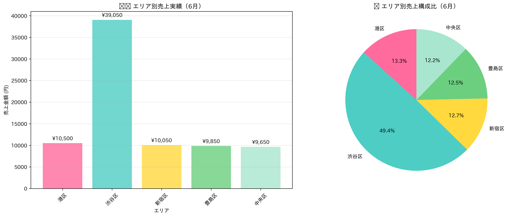
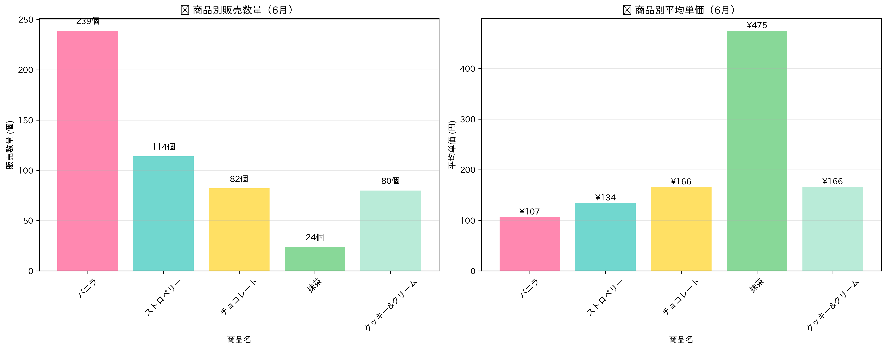

# 2024年6月度 売上実績報告

**営業部門 月次定例報告**

2024年6月29日

---

# 📊 エグゼクティブサマリー

## 6月実績概要

- **総売上**: 79,100円
- **前月比**: -3.5% （5月: 81,950円）
- **目標達成率**: 24.9% （目標: 317,550円）
- **販売数量**: 539個 （前月比: +44.9%）

## 🔍 重要ポイント
- 売上金額は微減も、**販売数量は大幅増加**
- **平均単価の下落**が売上減少の主因（-33.3%）

---

# 📈 月次売上推移

---

# 📈 月次売上推移データ

| 月 | 売上金額 | 販売数量 | 平均単価 |
|---|---|---|---|
| 2024年5月 | 81,950円 | 372個 | 220.3円 |
| 2024年6月 | 79,100円 | 539個 | 146.8円 |
| **増減** | **-2,850円** | **+167個** | **-73.5円** |

### 主な傾向
- 販売数量は前月比44.9%増加
- 平均単価の大幅下落が売上減少の主因

---

# 🏆 商品別パフォーマンス

---

# 🏆 商品別パフォーマンス詳細

## 好調商品
- **ハーゲンダッツ バニラ**: 25,500円（全売上の32.2%）
- **ハーゲンダッツ ストロベリー**: 15,300円（夏季需要で安定）

## 課題商品
- **ハーゲンダッツ 抹茶**: 11,400円（売上最少）
- **チョコレート・クッキー&クリーム**: 目標達成率14%未満

---

# 🎯 目標達成状況

| 商品名 | 実績 | 目標 | 達成率 |
|---|---|---|---|
| バニラ | 25,500円 | 59,500円 | **42.9%** |
| ストロベリー | 15,300円 | 42,500円 | **36.0%** |
| 抹茶 | 11,400円 | 22,800円 | **50.0%** |
| チョコレート | 13,600円 | 97,750円 | **13.9%** |
| クッキー&クリーム | 13,300円 | 95,000円 | **14.0%** |

## ⚠️ 重要指標
**全商品で目標を大幅に下回る結果**

---

# 🗺️ エリア別売上動向

---

# 🗺️ エリア別売上詳細

| 区 | 売上金額 | 構成比 |
|---|---|---|
| **渋谷区** | 39,050円 | **49.4%** |
| 港区 | 10,500円 | 13.3% |
| 新宿区 | 10,050円 | 12.7% |
| 豊島区 | 9,850円 | 12.4% |
| 中央区 | 9,650円 | 12.2% |

## 分析結果
- **渋谷区が圧倒的**（全体の約半分）
- 他エリアでの販売強化が急務

---

# 📊 数量・単価分析

---

# 🔮 7月予測

## 予測根拠
1. **季節要因**: 夏季本格化でアイスクリーム需要増加
2. **商品戦略**: バニラ・ストロベリーの販売強化
3. **エリア戦略**: 渋谷区以外の販売促進

## 予測値
- **予想売上**: 95,000円～105,000円（+20%～+33%）
- **予想販売数量**: 650個～700個
- **重点商品**: バニラ、ストロベリー、チョコレート

---

# ⚠️ 主要課題

## 1. 目標達成率の低さ
- 全商品で50%未満の達成率
- 特にチョコレート・クッキー&クリームが深刻

## 2. 平均単価の下落
- 商品ミックスの見直しが必要
- プレミアム商品の投入検討

## 3. 地域格差
- 渋谷区以外での販売促進が急務

---

# 💡 改善策

## 1. 価格戦略の見直し
- プレミアム商品の投入検討
- セット販売の導入

## 2. 販売チャネルの拡充
- 渋谷区以外での店舗展開・販促強化
- オンライン販売の検討

## 3. 商品戦略の最適化
- 売れ筋商品の在庫確保
- 不振商品のマーケティング強化

---

# 📝 まとめ

## 現状認識
- 販売数量は大幅増加（顧客接点の拡大成功）
- 売上金額は微減（単価下落が主因）
- 目標達成率は全体的に低水準

## 7月の取り組み
- 夏季需要の本格化を見込み
- 商品戦略とエリア戦略の両面から売上向上を図る

**継続的な改善により、目標達成を目指します**

---

# ご質問・ご意見

**ありがとうございました**

営業部門一同